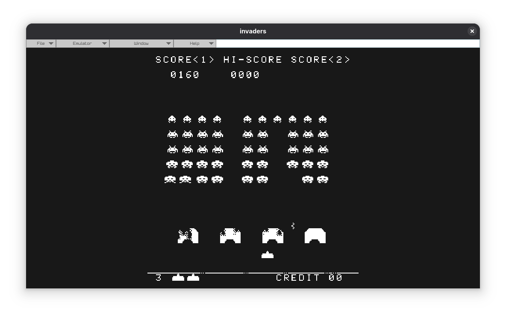
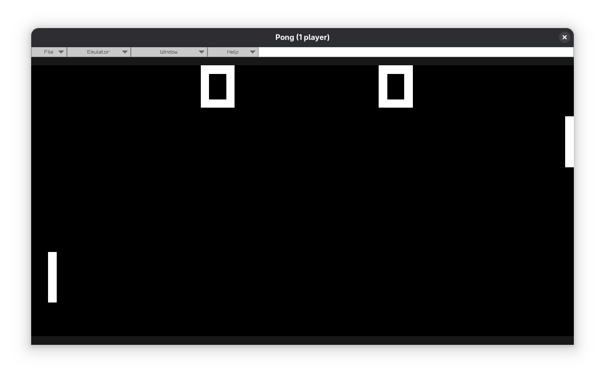
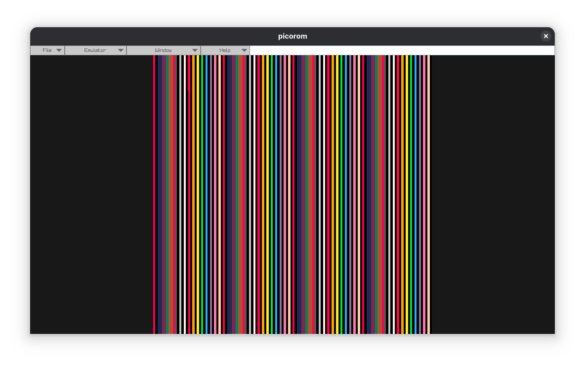

# PolyEmu

An emulator for the Chip8, intel8080 supporting space invaders and partially pico8 built with raylib.

## Installing

### Prebuilt binaries
Download the Appimage from [releases](https://github.com/0xurandom/PolyEmu/releases).

Make it executable and run:
```sh
chmod +x ./PolyEmu-x86_64.AppImage && ./PolyEmu-x86_64.AppImage
```


### Compile from source

#### Dependencies
- Raylib
- Lua
- JSON-C
- libzip
- gtk3


Clone the repo:
```sh
git clone https://github.com/0xurandom/PolyEmu.git && cd PolyEmu/
```

Compile with cmake:
```sh
cmake -B build && cmake --build build --target appimage
```

Run the appimage:
```sh
./build/PolyEmu-x86_64.AppImage
```

## Controls

### Chip8

```text
  Chip 8         Keyboard
  
  1 2 3 C         1 2 3 4
  4 5 6 D    ->   Q W E R
  7 8 9 E         A S D F
  A 0 B F         Z X C V
```

### Space Invaders

To play, insert a coin and start the game.

| Action | Keyboard Key |
|---|---|
| Insert Coin | `C` |
| Start Game | `Enter` |
| Move Left | `Left Arrow` |
| Move Right | `Right Arrow` |
| Shoot | `Spacebar` |

### Pico8

Pico8 controls are not yet supported.

## Shortcuts

| Shortcut | Action |
|---|---|
| Ctrl + O | Open Rom |
| Ctrl + R | Reset Emulator |
| Ctrl + P | Pause/Resume |
| Ctrl + F | Toggle Fullscreen |
| Esc | Exit Fullscreen |
| Ctrl + , | Open Settings |
| Ctrl + = | Hold to fast forward |
| F5 | Save State (Slot 5) |
| F7 | Load State (Slot 5) |

## Screenshots



